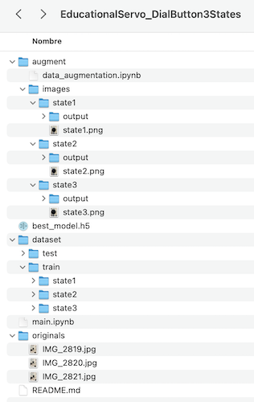

# Educational Servo - 3 State Button Classifier
This project shows an example of how to use a simple Keras model to implement classification using a simple CNN for images.

## Installation
1. Pull the code
2. Create a Python environment and activate it

    *e.g.* 
    1. `virtualenv -p python3 .venv` to create the virtual environment,

    2. `source .venv/bin/activate` to activate it an start installing dependencies.

3. Install requirements

*e.g.*
`pip install -r requirements.txt`

4. There are 2 notebooks (main.ipynb, augment/data_augmentation.ipynb), one for the training process and the other one for the image augmentation process

- The augmentation is done by using the [Augmentor](https://github.com/mdbloice/Augmentor) package

5. To generate the images, run the generator notebook and copy the files from *augment/images* into *dataset/*

> Folder names map to class names, which are represented in the variable `MAP_CLASSES` in main.ipynb

6. **main.ipynb** expects images to be .jpg instead of .png resulting from the augmentation. You can use the following command:

*e.g.*
`mogrify -format jpg *.png`

7. Once images are augmented, you can manually create a train/test split as you want (in this project, 1000 images, 750 for training and 250 for testing)

- The *dataset/train* folder has one folder for each class
    - The names of the files are OK after the augmentation

- The *dataset/test* folder has the test images. Take into account that the *class names* for this images are taken from the image name, so you will have to rename them:

    - *e.g.* state1_0.jpg, state1_1.jpg, state1_2.jpg ... state3_249

The classification predicts the state (3 possibilities) of the button

*e.g.*

